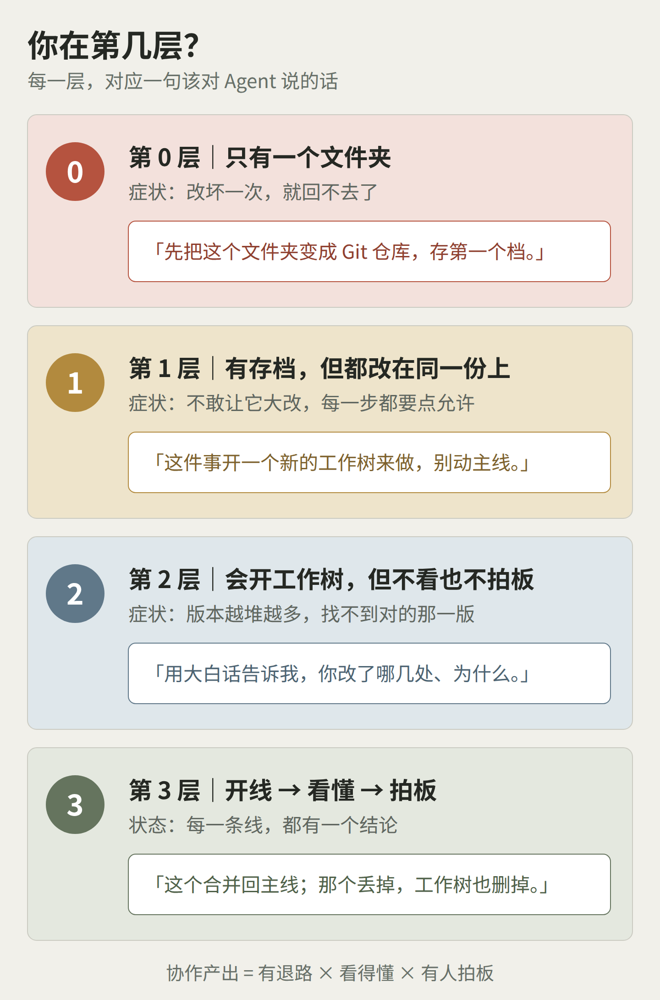
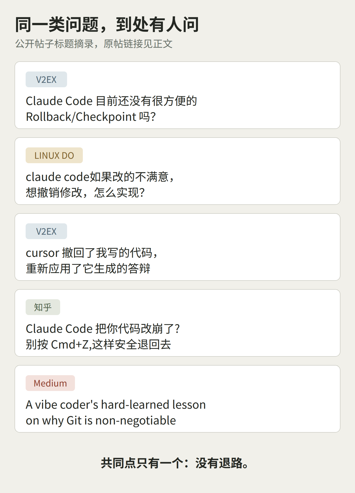
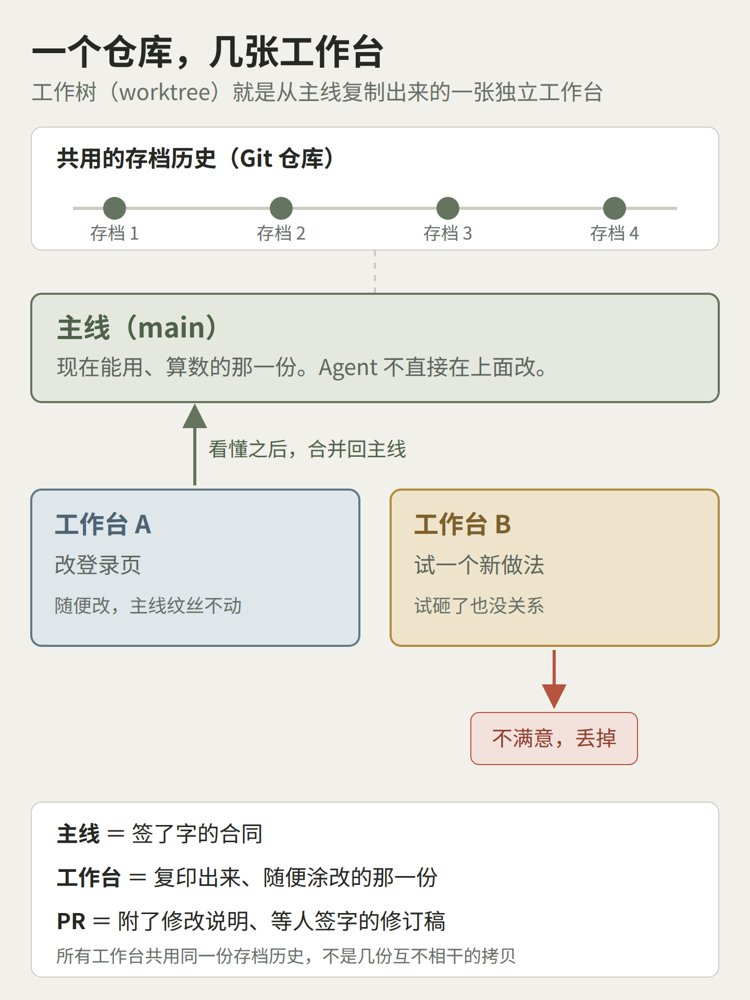
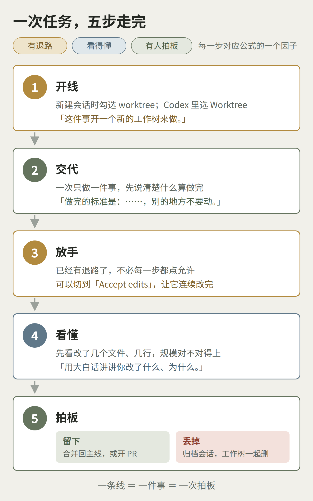

> **Kelly 陈霈霖**｜喜茶创始 CTO 兼董事会成员，维格 Vika / AITable 创始人。带过 150 人团队，主导 3 万人零售企业数字化转型；Vika 服务 100 万用户与 1.5 万家企业组织，获 IDG 资本、天图资本、五源资本、靖亚资本、高瓴创投投资，累计融资数千万美元。了解我：[个人简介](https://kellychan.im/resume/zh-cn/)｜[企业 AI 服务](https://kellychan.im/ai/)｜[CAIO Office](https://kellychan.im/ai/caio/)

最近我常遇到一类人。

他们不是工程师。是老板，是运营、市场、产品负责人。这半年，他们开始自己打开 Claude Code、Codex 这类工具，让 Agent 写内部小工具、报表脚本、落地页。

画面通常是这样的：Agent 每改一处，就弹一次确认，他就点一次允许。一个下午，点了几十次。

但界面上有一个选项，他从来没碰过。在 Claude 桌面版里，它就在分支名旁边，叫 worktree；在 Codex 里，它在输入框下面。

他也建过 PR。工具里有那个按钮，点一下就建好了。可建完之后该干什么——谁看、看什么、什么时候算数——没人跟他说过。

然后，问题陆续出现：前几天还能跑的那一版，找不到了；Agent 改了三轮，每轮都说“已完成”，他说不清哪一轮是对的；让它换个思路重来，它顺手把刚满意的那部分也改了。

我通常会问三个问题：

**第一，如果 Agent 现在把东西改坏了，你能回到改之前吗？**

**第二，它刚才说“已完成”，你知道它具体改了哪几处吗？**

**第三，手上这几个版本，哪一个算数？是谁定的？**

三个问题里只要有一个答不上来，问题就不在 Agent 不够聪明。

我把这种状态叫作：**协作盲区。**

你在用一个协作工具，却从来没有按协作的方式用它。

> **协作产出 = 有退路 × 看得懂 × 有人拍板**

所以，很多人以为卡住自己的是技术：不会 Git，看不懂代码，搞不清什么是分支。

**恰恰相反：技术那部分，Agent 已经替你做了。剩下归你的，只有协作上的决定。**

Agent 会替你敲每一条 Git 命令。你不需要会写 `git worktree add`，就像不需要会修打印机，也能把文件打出来。你要知道的只有三件事：什么时候让它另起一份，什么时候让它把改动讲给你听，什么时候由你说一句「这个留下」。

这三件事就是公式里的三个因子。中间是乘号：有退路、看不懂，你敢试，却不知道试出了什么；看得懂、没人拍板，版本越堆越多；有人拍板、没有退路，每一次拍板都是在赌。

**Git 不是技术门槛，是一套协作规矩。**

## 一、先看你在第几层

**第 0 层：只有一个文件夹。** 没有任何存档，Agent 改坏一次，就回不去了。

很多人以为工具自带的撤销就够了。Claude Code 的 `/rewind`、Cursor 的 checkpoint 确实能退回去，但范围有限：Claude Code 的 checkpoint 不记录 Agent 用命令行删除、移动的文件，也不记录你在工具外手动改的东西。官方文档原话是，它为“会话级的快速恢复”设计，长期的历史和协作，仍然要靠 Git 这样的版本控制。

还有一个容易被忽略的事实：Claude 桌面版的会话隔离需要 Git。文件夹还不是 Git 仓库，那个 worktree 选项对你来说就无从谈起——这也许正是很多人“从来没留意到”它的原因之一。

**第 1 层：有存档，但所有改动都在同一份上。** 你不敢让 Agent 大改，因为它一改就改在你正在用的那份上。于是只能每一步都盯着、每一步都点允许。开头那个点了一下午允许的人，多半在这一层。

**第 2 层：会开工作树，但不看、不拍板。** 线开了一条又一条，每条都改了点东西，没有一条被确认为“这个算数”。改好的那一版多半没丢，只是你不知道它在哪。Codex 的工作树默认放在 `$CODEX_HOME/worktrees` 下，根本不在你的项目文件夹里；它默认只保留最近 15 个，更早的会被自动清理——清理前会存快照，重新打开那次对话还能恢复。

**第 3 层：开线、看懂、拍板，一次一件事。** 每一条线最后都有一个结论：留下，或者丢掉。

这不是个别人的问题。去社区搜一下，同一类问题到处有人问：

原帖：[V2EX](https://v2ex.com/t/1149110)｜[LINUX DO](https://linux.do/t/topic/960425)｜[V2EX](https://www.v2ex.com/t/1146066)｜[知乎](https://zhuanlan.zhihu.com/p/2053252463784939621)｜[Medium](https://donnnachiu.medium.com/a-vibe-coders-hard-learned-lesson-on-why-git-is-non-negotiable-a8ac5a07fe00)

问法各不相同，缺的是同一样东西：退路。

## 二、先把四个词翻译成人话

**存档（commit）**：给当前状态拍一张快照。以后无论改成什么样，都能回到这一刻。

**主线（main）**：现在能用、算数的那一份。

**工作树（worktree）**：从主线复制出来的一张独立工作台。Agent 在上面随便改，主线纹丝不动。所有工作台共用同一份存档历史，不是几份互不相干的拷贝。Claude 桌面版默认把它放在项目里的 `.claude/worktrees/` 下。

**PR（Pull Request，合并请求）**：一张“申请把这张工作台上的改动并回主线”的单子，写着改了什么、为什么改，等人签字。它需要 GitHub 这样的远程仓库；如果你只在自己电脑上用，让 Agent 直接合并回主线就行。

用合同打个比方：主线是签了字的那份，工作台是复印出来随便涂改的那份，PR 是附了修改说明、等人签字的修订稿。

你会发现，这四个词没有一个是技术。它们是任何一家公司改合同、改方案时本来就有的规矩，只是换了个名字。

## 三、五句该对 Agent 说的话

不需要学命令。下面五句话，分别对应公式的三个因子。

**有退路：**

1. 「先帮我存个档，写清楚这一版是什么状态。」
2. 「这件事开一个新的工作树来做，别动主线。」在桌面版里，等价于新建会话时勾上 worktree。

**看得懂：**

3. 「用大白话告诉我：你改了哪几个文件，每处为什么改，有没有动我没让你动的地方。」

**有人拍板：**

4. 「这个合并回主线。」或者「这个丢掉，工作树也删掉。」
5. 「帮我开个 PR，标题写清楚改了什么，描述里列出我该检查的地方。」——有远程仓库时用。

第 3 句最容易被跳过，也最值钱。看改动不用看代码。Claude 桌面版会显示改动统计，比如 `+12 -1`。先看规模对不对得上：一句话就能说清的需求，结果动了几十个文件，多半说明它改了你没让它改的东西。

## 四、一次任务，五步走完

1. **开线。** 新建会话时勾选 worktree；Codex 里选 Worktree。
2. **交代。** 一次只做一件事，先说清楚什么算做完、哪些地方不许动。
3. **放手。** 已经有退路了，就不必每一步都点允许。Claude 桌面版可以切到 Accept edits，让它连续改完文件；遇到其他终端命令，它仍然会先问你。
4. **看懂。** 先看改动统计，再让它用大白话讲。需要的话，点一下 Review code，让它先自查一遍。
5. **拍板。** 留下，就合并回主线或者开 PR；丢掉，就在侧边栏归档这个会话，工作树会一起删掉。用 Codex 的话，可以用 Hand off 把结果带回本地，或者让它建分支、存档、开 PR。

注意第 3 步。开头那个点了一下午允许的人，缺的不是耐心，是退路。

**点一百次允许，不如先开一条线。**

## 五、第一周，只练这五步

**前三天：一次只开一条线。** 每次新任务都开线，每次结束都拍板。宁可慢，不留半成品。

**后四天：同时开两条线。** 一条做正事，一条做试验。练的不是速度，是丢掉的勇气：试验那条不满意，能不能毫不心疼地删掉？

不少工程师分享过同一个经验：一天里同时开着的线，两三条就是上限。再多，管理它们的精力就超过了它们带来的产出。你刚起步，两条足够。

## 六、什么算学会了

不是记住了四个词，而是你能在 10 秒内答出三个问题：

- 主线现在是哪一版？
- 手上开着几条线？
- 每一条，是留还是丢？

每一次拍板之前，你手上应该有一份很短的东西：这次要解决什么，它为什么这样改，改了哪些地方，怎么验证过，能看的画面或截图，有什么风险。最后一行，是你自己的名字。

Agent 负责敲命令、改文件、写说明。人负责三件事：决定开不开线，看懂改了什么，拍板留不留。**合并进主线这个动作，永远由人授权。**

也说清楚我不建议的事：

- 不建议一上来就同时开五个 Agent。并行不是能力，是管理负担。
- 不建议不看就合并。它说“已完成”，不等于完成。
- 不要拿工具的撤销按钮代替存档。它只负责这一次会话。

## 结语

我带过 150 人以上的产品、研发与数字运营团队。分支、合并、评审这套规矩，工程团队用了很多年；现在它第一次需要被不写代码的人学会。好消息是，你只需要学规矩，不需要学命令。

**Git 不是技术门槛，是一套协作规矩。**

**你不需要学会命令，只需要学会三个决定。**

**每一条线，都要有一次拍板。**

如果你正在自己跑 Agent，又总觉得乱，把手上开着的那几条线截个图发我，我们一起看看卡在哪一层。想有人陪你把“任务、PR、测试、发布”这条链跑顺，就是 Vibe Coding 项目陪跑在做的事。

- 企业 AI 服务：<https://kellychan.im/ai/>｜微信：`23110388`
